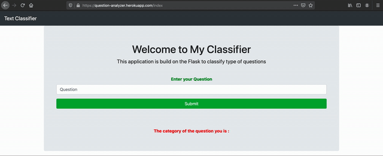

# Question-analyzer
Built a NLP based Deep-Learning model for multi-classification of question categories (what, when, who, affirmaton, unknown) and also developed a web-application using [flask](https://flask.palletsprojects.com/en/1.1.x/).

The classifier is deployed in the [Heroku](https://www.heroku.com/platform) application with the help of [gunicorn](https://gunicorn.org/) a WSGI HTTP Server for UNIX.

#### https://question-analyzer.herokuapp.com/index


## Setting up in Local Machine

#### Step-1 
Open a `terminal`, clone the `Question-analyzer` repository and go into the directory using the command `cd`.
```bash
git clone https://github.com/sherwin7/Question-analyzer.git

cd Question-analyzer
```

#### Step-2
Check `python-3` is installed then install `pip` manager for python-3 and install `virtual environment`.
```bash
#Checking python is installed
python3 --version 

#Installing pip manager
sudo apt install python3-pip

#Checking pip is installed for python3
pip3 --version

#Installing virtual environment
sudo pip3 install virtualenv
```

#### Step-3
Setting up `virtual environment`.
```bash
#Creating virtual environment
virtualenv -p python3 venv

#Activating the virtual environment venv
source venv/bin/activate
```

#### Step-4
Now we have to install all the dependencies using pip in our virtual environment from `requirements.txt`.
Check `requirements.txt` to know what are all the dependencies used.
```python
pip3 install -r requirements.txt
```

#### Step-5
Now we are going to run our application in our `localhost`
```bash
python app.py
```

#### Step-6
Open your browser and go to `localhost:5000/index` we can see our application running in the localhost.
```bash
http://127.0.0.1:5000/index
```
### Demo

